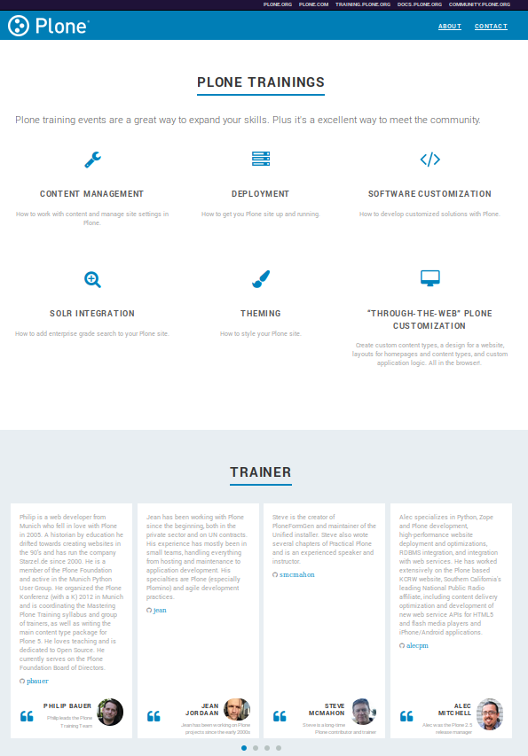

training.plone.org
==================

IMPORTANT
---------

As of PloneConf 2022, this repository is no longer in use.
It is read-only and has been archived.

Introduction
------------

**NOTE:** Please **do not** commit straight to master, **ALWAYS** create a Pull Request !

This is the landing page of `training.plone.org <https://training.plone.org>`_ a static website build with `Hugo <https://gohugo.io/>`_.

If you are looking for the training manuals repository, please check https://github.com/plone/training.

Features
--------

- Based on the `Hugo Universal Theme <https://github.com/devcows/hugo-universal-theme>`_
- Responsive design
- Content written in Markdown
- Various options as

  - News teaser [carousel]
  - `Formspree <https://formspree.io/>`_ integration
  - Blog integration
  - Google search
  - Disqus comments
  - Google Analytics

Example
-------

Documentation
-------------

Full documentation for end users can be found in the "docs" folder.

Contribute
----------

- `Issue Tracker <https://github.com/plone/training.plone.org/issues>`_
- `Source Code <https://github.com/plone/training.plone.org>`_

License
-------

The project is licensed under the MIT License
