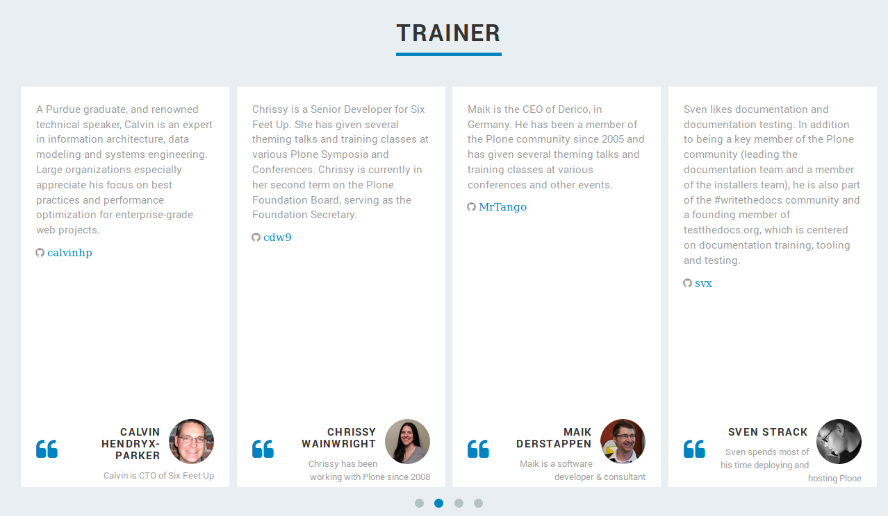

==============
Update Trainer
==============

.. topic:: About Trainer

    How to update or add a trainer to the overview

All trainings are located under *data/testimonials*, each trainer as its own yaml.file.

Example
=======

.. code-block:: yaml

    text: "Sven likes documentation and documentation testing. In addition to being a key member of the Plone community (leading the documentation team and a member of the installers team), he is also part of the #writethedocs community and a founding member of testthedocs.org, which is centered on documentation training, tooling and testing."
    name: "Sven Strack"
    position: "Sven spends most of his time deploying and hosting Plone"
    avatar: "img/testimonials/svx.jpg"
    github: "svx"

.. note:: This will be re-written in the future

.. note:: Currently the is no special order, if you are not happy with your position you have to change the number of 'your' yaml file.
