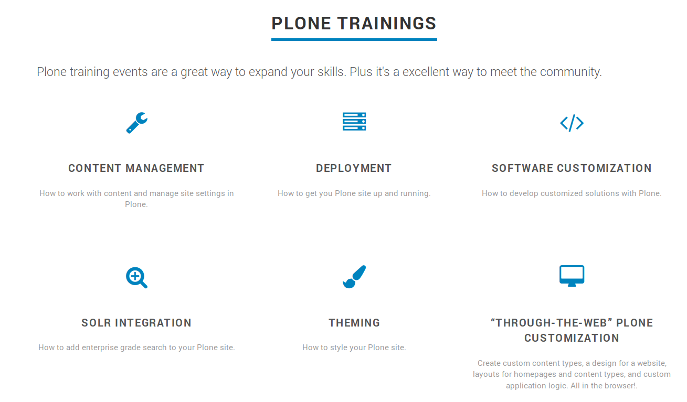

================
Update Trainings
================

.. topic:: About trainings

    How to update or add a training to the overview

All trainings are located under *data/features*, each training as its own yaml.file.

Example
=======

Solr Training
-------------

.. code-block:: yaml

    weight: 1
    name: "Solr Integration"
    icon: "fa fa-search-plus fa-2x"
    description: "How to add enterprise grade search to your Plone site."
    link: "https://training.plone.org/5/solr-training/index.html"

